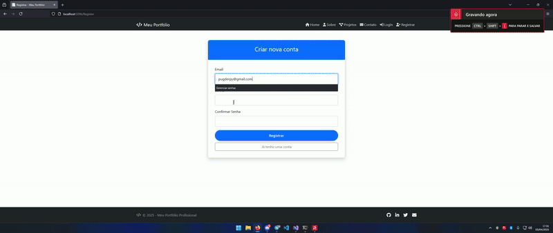

# PortfolioCSH - Portfólio Pessoal em ASP.NET Core


Um projeto de portfólio profissional desenvolvido em ASP.NET Core para demonstrar habilidades, projetos e informações de contato.

## 📂 Estrutura do Projeto
```
PortfolioCSH/
├── wwwroot/
│ ├── css/ # Folhas de estilo
│ ├── js/ # Scripts JavaScript
│ └── lib/ # Bibliotecas externas
├── Pages/ # Páginas Razor
│ ├── Shared/ # Layouts compartilhados
│ ├── Contato.cshtml # Página de contato
│ └── Projetos.cshtml # Galeria de projetos
├── appsettings.json # Configurações
└── Program.cs # Ponto de entrada

```

## ✨ Funcionalidades

- **Páginas Responsivas**
  - Home (Index)
  - Sobre Mim
  - Portfólio de Projetos
  - Formulário de Contato
  - Política de Privacidade

- **Componentes Reutilizáveis**
  - Layout principal
  - Scripts de validação
  - Estilos compartilhados

## 🛠️ Tecnologias

- ASP.NET Core 6.0
- Razor Pages
- HTML5 Semântico
- CSS3 Flexbox/Grid
- JavaScript ES6+
- Bootstrap 5 (presumido)

## 🔐 Funcionalidades de Autenticação Adicionadas 

##### Foi implementado um sistema completo de autenticação de usuários com:
## __Registro de novos usuários__

Validação de campos

Criptografia de senhas (usando ASP.NET Core Identity)

Confirmação via e-mail (opcional)

## Login seguro

Autenticação baseada em cookies

Proteção contra ataques de força bruta

Gerenciamento de sessões

## Banco de Dados

Armazenamento seguro de credenciais

Hash de senhas usando algoritmos PBKDF2

Migrações para atualização do schema


## 📦 Dependências Adicionais

    Microsoft.AspNetCore.Identity.EntityFrameworkCore

    Microsoft.EntityFrameworkCore.SqlServer

    Microsoft.AspNetCore.Identity.UI

## ⚙️ Configuração

As configurações de conexão com o banco de dados e políticas de senha podem ser ajustadas no arquivo appsettings.json.
json
Copy
```
"Identity": {
  "Password": {
    "RequiredLength": 8,
    "RequireDigit": true,
    "RequireLowercase": true,
    "RequireUppercase": true,
    "RequireNonAlphanumeric": true
  }
}
``` 
Para testar localmente, execute as migrações do Entity Framework Core:
bash

dotnet ef database update
