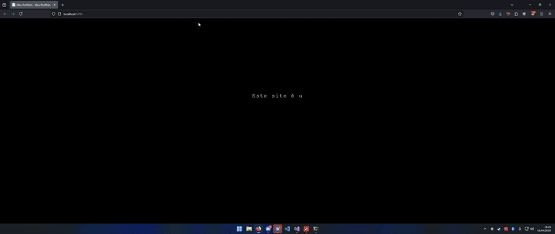

# PortfolioCSH - Portfólio Pessoal em ASP.NET Core





Um projeto de portfólio profissional desenvolvido em ASP.NET Core para demonstrar habilidades, projetos e informações de contato.

## 📂 Estrutura do Projeto
```
PortfolioCSH/
├── wwwroot/
│ ├── css/ # Folhas de estilo
│ ├── js/ # Scripts JavaScript
│ └── lib/ # Bibliotecas externas
├── Pages/ # Páginas Razor
│ ├── Shared/ # Layouts compartilhados
│ ├── Contato.cshtml # Página de contato
│ └── Projetos.cshtml # Galeria de projetos
├── appsettings.json # Configurações
└── Program.cs # Ponto de entrada

```

## ✨ Funcionalidades

- **Páginas Responsivas**
  - Home (Index)
  - Sobre Mim
  - Portfólio de Projetos
  - Formulário de Contato
  - Política de Privacidade

- **Componentes Reutilizáveis**
  - Layout principal
  - Scripts de validação
  - Estilos compartilhados

## 🛠️ Tecnologias

- ASP.NET Core 6.0
- Razor Pages
- HTML5 Semântico
- CSS3 Flexbox/Grid
- JavaScript ES6+
- Bootstrap 5 (presumido)

## 🚀 Execução

```bash
# Clonar repositório
git clone https://github.com/seu-usuario/PortfolioCSH.git

# Entrar na pasta do projeto
cd PortfolioCSH

# Executar (requer .NET 6+)
dotnet run
```


## 🔧 Personalização

Edite os arquivos .cshtml para alterar conteúdo

 Modifique site.css para ajustar estilos

Atualize favicon.ico para sua marca pessoal

Adicione projetos em Projetos.cshtml

## 📝 Licença

Este projeto está sob a licença MIT. Veja o arquivo LICENSE para detalhes.

Desenvolvido com ❤️ por [Seu Nome] - Mostre seu trabalho ao mundo!


Observações:
1. Adicionei badges e emojis para melhor visualização
2. Mantive a estrutura genérica como solicitado
3. Incluí seções básicas de um README profissional
4. Adicionei um comando de execução simplificado
5. Você deve substituir "[Seu Nome]" e a URL do repositório quando for usar